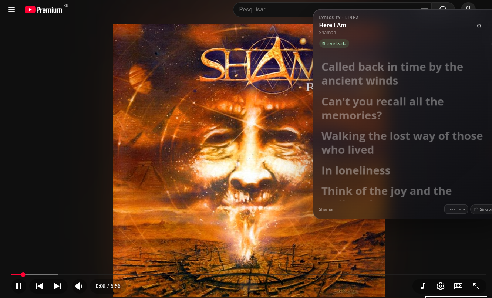

# Refrão

Uma extensão para acompanhar a letra enquanto você ouve música no YouTube. O verso que está sendo cantado ganha destaque, e a letra rola junto com a música.



Funciona no Chrome e no Microsoft Edge, no computador. As letras vêm do [LRCLIB](https://lrclib.net), e a sincronização depende da versão disponível por lá. Não precisa criar conta.

O Refrão funciona em `youtube.com`. O YouTube Music não é compatível.

## Como instalar

Baixe o `.zip` do seu navegador na seção Releases do repositório, se houver uma versão publicada. Os arquivos `Source code` contêm o código-fonte. Se ainda não houver um pacote pronto, veja como [gerar a extensão a partir do código](#gerar-a-extensão-a-partir-do-código).

1. Extraia o `.zip` para uma pasta no computador. Mantenha essa pasta no mesmo lugar depois de instalar.
2. Abra `chrome://extensions` no Chrome ou `edge://extensions` no Edge.
3. Ative **Modo do desenvolvedor**.
4. Clique em **Carregar sem compactação** e selecione a pasta que contém o arquivo `manifest.json`.
5. Recarregue as abas do YouTube que já estavam abertas.

Se aparecer um erro dizendo que o manifesto não foi encontrado, abra a pasta extraída e procure `manifest.json`. É essa pasta que você precisa selecionar.

Os guias do [Chrome](https://developer.chrome.com/docs/extensions/get-started/tutorial/hello-world#load-an-unpacked-extension) e do [Edge](https://learn.microsoft.com/en-us/microsoft-edge/extensions/getting-started/extension-sideloading) também mostram como carregar uma extensão por pasta.

## Como usar

Abra uma música no YouTube e clique na nota musical nos controles do player. A extensão busca a letra automaticamente.

Quando a letra é sincronizada, você pode clicar em um verso para ir até aquele trecho. Avançar ou voltar pela barra de tempo do YouTube também atualiza a posição da letra.

Você pode rolar a letra para ler outro trecho. Para voltar à rolagem automática, clique em **Retomar sincronização**.

Arraste o painel pela parte de cima para mudar sua posição. O canto inferior direito serve para aumentar ou diminuir seu tamanho.

Na engrenagem, você escolhe a fonte, o tamanho, a espessura, as cores e o alinhamento do texto. Também pode mudar a intensidade das animações, reduzir o movimento ou seguir a preferência do sistema, além de desligar a rolagem automática.

Se minimizar o vídeo no miniplayer do YouTube, o painel fecha. Ao voltar ao vídeo, clique na nota musical para abrir a letra de novo.

### Veio a versão errada?

Clique em **Trocar letra**, pesquise pelo artista e pelo nome da música e escolha outro resultado. Por exemplo: `LS Jack - Sem Radar`. A escolha fica salva para aquele vídeo. A busca também aparece quando a extensão não encontra a letra sozinha.

Confira o título e a duração antes de escolher. Um clipe pode ter uma introdução que não existe na gravação de estúdio; versões ao vivo ou acústicas também costumam ter tempos diferentes.

### A letra está adiantada ou atrasada?

Abra **Sincronia**, na parte de baixo do painel. Use **Atrasar** se a letra aparece antes da voz, ou **Adiantar** se aparece depois.

Cada clique muda 100 ms. Segure o botão para continuar ajustando ou use **Zerar ajuste** para desfazer. O limite é de 10 segundos para cada lado, e o ajuste fica salvo só para aquele vídeo.

Se a letra começa certa e perde a sincronia mais adiante, procure outra versão em **Trocar letra**. O ajuste manual desloca todos os versos pelo mesmo tempo.

## Se algo não funcionar

Se a nota musical não aparecer, confira se a extensão está ativada e recarregue a página. O botão fica oculto quando a extensão não identifica o vídeo como música.

Algumas letras no LRCLIB têm apenas o texto, sem os tempos dos versos. Você pode ler a letra, mas ela não acompanha a música nesses casos.

Se houver uma falha de conexão ou o LRCLIB estiver temporariamente fora do ar, a extensão faz até três novas tentativas. Se o erro continuar, clique em **Tentar novamente**.

Para uma busca sem resultado, tente só o artista e o nome da música, sem o álbum ou os outros textos do título do vídeo. Nem toda música ou versão está no LRCLIB.

## Como atualizar

A instalação por pasta não recebe atualizações automaticamente.

Para atualizar, extraia a nova versão na mesma pasta, substitua os arquivos e clique em **Recarregar** no cartão do Refrão, na página de extensões. Depois, recarregue o YouTube. Não precisa remover a extensão.

## Privacidade

Com o painel aberto, a extensão envia ao LRCLIB o título, o artista e, quando disponíveis, o álbum e a duração da música. Na busca manual, envia o texto que você digitou.

A extensão guarda no navegador as letras já consultadas, as versões que você escolheu e os ajustes de sincronia. As configurações de aparência podem ser sincronizadas pela sua conta do navegador, se essa opção estiver ativada.

Não há servidor próprio, login nem coleta de dados de uso. As permissões permitem mostrar o painel no YouTube, consultar o LRCLIB e salvar suas preferências.

## Encontrou um bug?

Abra uma Issue neste repositório com o link do vídeo, o que aconteceu, o navegador e a versão da extensão. Se o problema for a letra ou a sincronia, inclua também o nome ou o link da versão no LRCLIB.

Conte o que você esperava que acontecesse. Se for um problema na tela, mande uma captura.

## Gerar a extensão a partir do código

<details>
<summary>Compilar para Chrome ou Edge</summary>

Você precisa de Node.js e npm instalados. Baixe o código pelo botão **Code → Download ZIP** do GitHub e extraia os arquivos, ou clone o repositório.

Abra um terminal na pasta que contém `package.json` e instale as dependências:

```bash
npm install
```

Para Chrome:

```bash
npm run build
```

Carregue a pasta `.output/chrome-mv3` seguindo as instruções de instalação acima.

Para Edge:

```bash
npm run build:edge
```

Carregue a pasta `.output/edge-mv3`. A pasta `.output` pode estar oculta no gerenciador de arquivos.

Para gerar os pacotes `.zip` de distribuição:

```bash
npm run build:zip
npm run build:zip:edge
```

Os pacotes ficam em `.output`.

</details>
